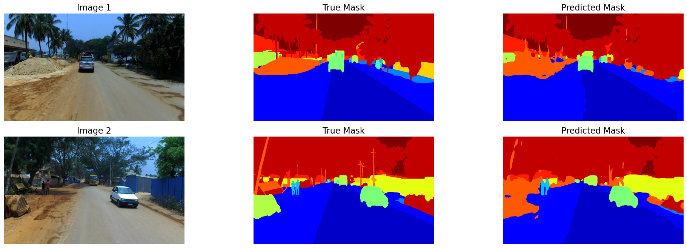

# Segmentation of Indian Traffic

This project explores semantic segmentation of Indian traffic scenes using deep learning. It implements and compares two models: a classic UNet and a custom-built CANet architecture. The goal is to segment images from the India Driving Dataset to understand real-world unstructured traffic environments.

---

## 📌 Project Highlights

- Transfer Learning of UNet and a custom implementation of CANet for semantic segmentation
- Data preprocessing, augmentation, and label remapping specific to the India Driving Dataset
- Evaluation based on Intersection over Union (IoU) metric
- End-to-end pipeline including training, evaluation, and inference

---

## 📂 Dataset

This project uses the India Driving Dataset (IDD) from [idd.insaan.iiit.ac.in](https://idd.insaan.iiit.ac.in/). The dataset contains images captured from a front-facing car camera driven around Hyderabad, Bangalore, and outskirts, along with polygon annotations in JSON format.

---

## 🧱 Model Architecture

- **UNet:** A widely-used encoder-decoder CNN for image segmentation, leveraging skip connections for precise localization.
- **Custom CANet:** An attention-based convolutional architecture designed to improve feature representation. Further improvements planned to address class imbalance and optimize performance.

---

## 📈 Evaluation & Results

### Observations:
- UNet achieved an IoU score of **49.99%**, outperforming CANet, which achieved **33.56%**.
- CANet's lower performance is influenced by class imbalance within the dataset.
- Future improvements for CANet include applying class-weighted loss functions, focal + dice loss, or data sampling strategies to mitigate class imbalance.
- Additional experiments with architecture depth, attention mechanisms, and data augmentation could enhance results.

### Conclusion:
- UNet currently provides stronger segmentation results on the IDD dataset.
- Addressing class imbalance and refining CANet architecture are key next steps.
- These improvements aim to enhance CANet’s effectiveness in handling real-world traffic scene segmentation.

---

## 🔍 Sample Output
these results on the same images
### UNet Segmentation Output

### CANet Segmentation Output

---

## 🛠️ Development Environment

### 💻 Hardware

*   **GPU:** NVIDIA RTX 3060 (12GB VRAM)  
*   **CPU:** AMD Ryzen 5 3600 (6 cores, 12 threads)  
*   **RAM:** 32 GB DDR4  

### 🧪 Virtual Environment

*   **Key Packages:**  
    *   Python 3.10  
    *   tensorflow==2.19.0  
    *   tf-keras==2.19.0  
    *   keras==3.9.2  
    *   pandas==1.4.2  
    *   numpy==1.26.4  
    *   matplotlib==3.10.0
    *   pillow==11.2.1
    *   albumentations==2.0.6
    *   imgaug=0.4.0
    *   segmentation-models==1.0.1
